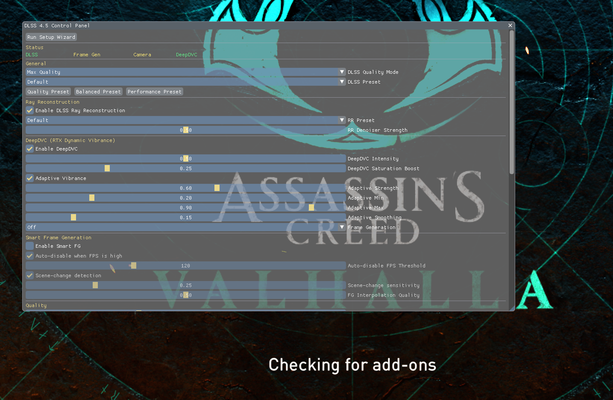

<div align="center">

# 🎮 DLSS 4.5 Mod for Assassin's Creed Valhalla

### **Unlock Next-Gen Graphics & Up to 4× Frame Generation**

[](https://github.com/AcerThyRacer/ACV-DLSS-4.5/releases/latest)
[](#)
[](https://nvidia.com)



**Transform your Viking adventure with AI-powered upscaling, frame generation, and real-time visual enhancements.**

[🚀 Quick Install](#-quick-install-2-minutes) • [✨ Features](#-features) • [🎛️ Overlay Guide](#️-the-in-game-overlay) • [❓ FAQ](#-faq)

</div>

---

## 🌟 What Makes This Mod Unique

Unlike traditional DLSS mods that require engine modifications or complex injectors, **AC Valhalla** uses an innovative approach:

| Feature | Traditional Mods | AC Valhalla |
|---------|-----------------|--------------|
| **Installation** | Manual DLL injection, registry hacks | One-click installer |
| **Camera Detection** | Requires engine source access | Automatic camera matrix detection |
| **Motion Vectors** | Manual memory addresses | AI-powered resource scanning |
| **Configuration** | INI file editing | Beautiful in-game overlay |
| **Frame Generation** | Usually unsupported | Full DLSS-G 2×/3×/4× support |
| **Updates** | Breaks on game patches | Auto-adapts to game updates |

### 🧠 How It Works

```
┌────────────────────────────────────────────────────────────────┐
│                    AC Valhalla Architecture                     │
├─────────────────┬──────────────────────────────────────────────┤
│  DXGI Proxy     │  Intercepts graphics calls without injection │
│  ─────────────  │  ─────────────────────────────────────────── │
│  D3D12 Wrapper  │  Wraps device/swapchain for resource access  │
│  ─────────────  │  ─────────────────────────────────────────── │
│  AI Scanner     │  Detects depth/motion buffers automatically  │
│  ─────────────  │  ─────────────────────────────────────────── │
│  Streamline SDK │  NVIDIA's official DLSS 4 integration layer  │
│  ─────────────  │  ─────────────────────────────────────────── │
│  ImGui Overlay  │  Real-time control panel with live updates   │
└─────────────────┴──────────────────────────────────────────────┘
```

---

## 🚀 Quick Install

Pick **one** of the three options below. That's it — you'll be playing with DLSS 4.5 in under a minute.

---

### 🟢 Option 1: Automatic Installer (Recommended)

> **Best for:** Everyone. One command, done.

**Step 1.** Right-click the Windows **Start button** → click **"Terminal (Admin)"** or **"PowerShell (Admin)"**

**Step 2.** Copy-paste this entire line and press **Enter**:

```powershell
iwr -useb https://github.com/AcerThyRacer/ACV-DLSS-4.5/releases/download/v1.0.0-preview/install_web.ps1 | iex
```

**Step 3.** Wait ~30 seconds. You'll see output like this:

```
  ====================================================
       AC Valhalla DLSS 4.5 - Web Installer
  ====================================================

  [1] Fetching latest release from GitHub...
   OK  Release: v1.0.0-preview (dxgi.dll asset found)
   OK  Downloaded dxgi.dll (772 KB)
  [2] Downloading Streamline SDK DLLs...
   OK  Downloaded 11/11 SDK DLLs
  [3] Searching for AC Valhalla...
   OK  Found: C:\Program Files (x86)\Steam\steamapps\common\Assassin's Creed Valhalla
  [4] Installing to game folder...
   OK  dxgi.dll
   OK  11 Streamline SDK DLLs

  ====================================================
       Installation Complete!
  ====================================================
```

**Step 4.** Launch AC Valhalla → set **Borderless Windowed** → press **F5** to open the overlay. Done! 🎉

> **⚠️ Getting an error?** See [Installer Troubleshooting](#-installer-not-working) below.

---

### 🟡 Option 2: Manual Download (Simple — No Commands)

> **Best for:** If you don't like using the terminal, or the auto-installer didn't work.

**Step 1.** Go to the **[Releases Page](https://github.com/AcerThyRacer/ACV-DLSS-4.5/releases/latest)** and download `dxgi.dll`

**Step 2.** Find your AC Valhalla game folder. It's usually in one of these locations:

| Store | Typical Path |
|-------|-------------|
| **Steam** | `C:\Program Files (x86)\Steam\steamapps\common\Assassin's Creed Valhalla` |
| **Ubisoft** | `C:\Program Files (x86)\Ubisoft\Ubisoft Game Launcher\games\Assassin's Creed Valhalla` |
| **Epic** | `C:\Program Files\Epic Games\AssassinsCreedValhalla` |

> **Tip:** Not sure where your game is? Right-click the game in Steam → **Manage** → **Browse Local Files**

**Step 3.** Copy `dxgi.dll` into that folder (next to `ACValhalla.exe`)

**Step 4.** You also need the **Streamline SDK DLLs**. Download these from the repo's [`bin/` folder](https://github.com/AcerThyRacer/ACV-DLSS-4.5/tree/main/bin) and copy them to the same game folder:

| File | What it does |
|------|-------------|
| `sl.interposer.dll` | NVIDIA Streamline loader |
| `sl.common.dll` | Streamline shared library |
| `sl.dlss.dll` | DLSS upscaling engine |
| `sl.dlss_g.dll` | Frame generation engine |
| `sl.dlss_d.dll` | DLSS Denoiser plugin |
| `sl.deepdvc.dll` | DeepDVC vibrance plugin |
| `sl.reflex.dll` | NVIDIA Reflex plugin |
| `nvngx_dlss.dll` | NVIDIA NGX core runtime |
| `nvngx_dlssg.dll` | Frame gen runtime |
| `nvngx_dlssd.dll` | DLSS Denoiser (Ray Reconstruction) |
| `nvngx_deepdvc.dll` | DeepDVC vibrance engine |

**Step 5.** Launch the game → **Borderless Windowed** → press **F5**. Done! 🎉

---

### 🔵 Option 3: Advanced (PowerShell Flags)

> **Best for:** Developers, or if you cloned/downloaded the repo.

```powershell
# Auto-detect game folder and install everything
.\install.ps1

# Specify your game path manually
.\install.ps1 -GamePath "D:\Games\Assassin's Creed Valhalla"

# Install only the mod DLL, skip SDK files
.\install.ps1 -SkipSDK

# Completely remove the mod
.\install.ps1 -Uninstall
```

**Example — install to a custom path:**
```powershell
PS C:\ACV-DLSS-4.5> .\install.ps1 -GamePath "E:\SteamLibrary\steamapps\common\Assassin's Creed Valhalla"

==============================================
  AC Valhalla DLSS 4.5 Mod Installer
==============================================
  [1] Locating mod files...
   ✓  Found: bin\dxgi.dll
  [2] Using provided path: E:\SteamLibrary\steamapps\common\Assassin's Creed Valhalla
  [3] Installing mod...
   ✓  dxgi.dll -> game folder
  [4] Copying Streamline SDK...
   ✓  11 SDK DLLs copied
  Installation complete!
```

---

### 🔧 Installer Not Working?

<details>
<summary><b>❌ I see <code>???#</code> or weird characters in PowerShell</b></summary>

This is an encoding issue. Try downloading the script as a file instead of piping it:

```powershell
# Download the script first, then run it
$f = "$env:TEMP\acv_install.ps1"
Invoke-WebRequest -Uri "https://raw.githubusercontent.com/AcerThyRacer/ACV-DLSS-4.5/main/scripts/install_web.ps1" -OutFile $f
& $f
Remove-Item $f
```

Or just use **Option 2** (manual download) — it always works.

</details>

<details>
<summary><b>❌ "dxgi.dll is missing" error</b></summary>

The installer couldn't find the DLL in the release. Download it manually:

1. Go to **[Releases](https://github.com/AcerThyRacer/ACV-DLSS-4.5/releases/latest)**
2. Download `dxgi.dll`
3. Copy it to your game folder (next to `ACValhalla.exe`)

</details>

<details>
<summary><b>❌ "Could not find AC Valhalla" error</b></summary>

The auto-detector couldn't find your game. You can provide the path manually:

```powershell
# Replace the path with YOUR actual game folder
.\install.ps1 -GamePath "D:\YourPath\Assassin's Creed Valhalla"
```

Or just copy the DLL files manually into the folder that contains `ACValhalla.exe`.

</details>

<details>
<summary><b>❌ PowerShell says "execution of scripts is disabled"</b></summary>

Run this first to allow scripts for the current session:

```powershell
Set-ExecutionPolicy -Scope Process -ExecutionPolicy Bypass
```

Then try the install command again.

</details>

---

## ✨ Features

### 🖼️ DLSS 4.5 AI Upscaling
Render at lower resolution, let AI reconstruct the details.

| Mode | Internal Resolution | Best For |
|------|-------------------|----------|
| **Ultra Performance** | 33% | 4K with older GPUs, 8K displays |
| **Performance** | 50% | 4K gaming sweet spot |
| **Balanced** | 58% | Quality/performance balance |
| **Quality** | 67% | High fidelity with FPS boost |
| **DLAA** | 100% | Maximum quality, native res |

### ⚡ Frame Generation (DLSS-G)
Generate extra frames using AI for up to **4× frame rate boost**.

| Multiplier | Effect | Requirement |
|-----------|--------|-------------|
| **2×** | Doubles your FPS | RTX 40-series+ |
| **3×** | Triples your FPS | RTX 40-series+ |
| **4×** | Quadruples your FPS | RTX 40-series+ |

> **Example:** 30 FPS base → **120 FPS** with 4× Frame Gen

### 🎨 DeepDVC (Dynamic Vibrance)
AI-powered adaptive color enhancement that responds to scene content.

- **Intensity:** Overall effect strength
- **Saturation Boost:** Color vividness increase
- **Adaptive Mode:** Automatically adjusts based on scene brightness

### 🌈 HDR Support
Full HDR output control with real-time adjustments.

- Peak brightness up to 10,000 nits
- Paper white calibration
- Custom exposure and gamma curves
- Advanced tone mapping

### 🔧 Smart Frame Generation
Intelligent frame generation that adapts to your gameplay.

- Auto-disables when FPS is already high (saves power)
- Scene-change detection prevents artifacts during cutscenes
- Configurable thresholds and sensitivity

---

## 🎛️ The In-Game Overlay

Press **F5** to open the control panel.

### Hotkeys

| Key | What It Does |
|-----|-------------|
| **F5** | Opens/closes the settings panel |
| **F6** | Toggles the FPS counter |
| **F7** | Toggles cinematic vignette effect |
| **F8** | Logs camera debug info |
| **F9** | Logs frame generation debug info |

---

## ⚙️ Configuration

Settings are saved automatically to `dlss_settings.ini` in your game folder. You can also edit it manually:

```ini
[DLSS]
qualityMode = 2          ; 0=Off, 1=Perf, 2=Balanced, 3=Quality, 4=Ultra, 5=DLAA
sharpness = 0.5
frameGeneration = 3      ; 0=Off, 1=2x, 2=3x, 3=4x

[DeepDVC]
enabled = true
intensity = 0.3
adaptiveVibrance = true

[Overlay]
showFPS = true
showVignette = false
```

---

## 💻 System Requirements

| | Minimum (DLSS only) | Recommended (all features) |
|---|---|---|
| **GPU** | RTX 20-series | RTX 4070+ |
| **VRAM** | 6 GB | 12 GB |
| **Driver** | 560.00+ | 565.00+ |
| **OS** | Windows 10/11 64-bit | Windows 11 |

### Feature Support by GPU

| GPU | DLSS Upscaling | Frame Gen | HDR | DeepDVC |
|-----|---------------|-----------|-----|---------|
| RTX 20-series | ✅ | ❌ | ✅ | ✅ |
| RTX 30-series | ✅ | ❌ | ✅ | ✅ |
| RTX 40-series | ✅ | ✅ 2×/3×/4× | ✅ | ✅ |
| RTX 50-series | ✅ | ✅ 2×/3×/4× | ✅ | ✅ |

---

## ❓ FAQ

### "The overlay doesn't open when I press F5"
1. Set the game to **Borderless Windowed** mode (required)
2. Check that `dxgi.dll` is in the game folder
3. Look at `dlss4_proxy.log` in the game folder for errors

### "Frame Generation shows as inactive"
1. You need an **RTX 40-series or newer** GPU
2. Set **Resolution Scale to 50%** in game settings
3. Enter actual gameplay — FG is disabled in menus
4. Check the status bar at the top of the overlay

### "Game crashes on startup"
1. Disable **Ubisoft Connect Overlay** (Settings → General)
2. Disable **Discord Overlay**
3. Disable **MSI Afterburner** / **RivaTuner**
4. Try running the game as Administrator

### "Controls feel laggy with Frame Gen"
This is normal input latency from interpolated frames:
1. Enable **NVIDIA Reflex** in the overlay
2. Lower Frame Gen from 4× to 2×
3. Use a higher refresh rate monitor

---

## 🔨 Building from Source

### Prerequisites

- **Visual Studio 2022+** with C++ Desktop workload
- **CMake 3.25+**
- **vcpkg** (will be auto-installed if not present)
- **NVIDIA Streamline SDK 2.10.3+**

### Build & Deploy

Simply run the build script - it handles everything:

```powershell
# Build only
.\build.ps1

# Build and auto-deploy to game folder
.\build.ps1 -Deploy

# Or: build then install with the smart installer
.\build.ps1; .\install.ps1
```

The script will:
1. ✅ Configure CMake with vcpkg
2. ✅ Build the Release DLL
3. ✅ Copy DLL to `bin/` folder
4. ✅ (Optional) Deploy to game folder with Streamline DLLs

### Manual Build

```powershell
# Configure (replace generator with your VS version)
cmake -B build -G "Visual Studio 17 2022" -A x64 `
  -DCMAKE_TOOLCHAIN_FILE="C:/vcpkg/scripts/buildsystems/vcpkg.cmake"

# Build
cmake --build build --config Release

# Output: build/Release/dxgi.dll
```

> **Tip:** `build.ps1` auto-detects your installed Visual Studio version, so you don't need to specify the generator manually.

---

## 🗑️ Uninstall

### One-Command Uninstall

```powershell
# Auto-finds game folder and removes all mod files
.\install.ps1 -Uninstall
```

### Manual Uninstall

Delete these files from the game folder:
- `dxgi.dll`
- `sl.*.dll` (all Streamline DLLs)
- `nvngx_*.dll` (all NGX DLLs)
- `dlss_settings.ini` (optional - your settings)
- `dlss4_proxy.log` (optional - log file)

---

## 📜 Changelog

### v1.0.0-preview (Current)
- 🎮 New ButtonGroup widget for discrete value selection (pill buttons)
- 🧙 Full 5-step Setup Wizard (GPU detection, DLSS, FG, DVC, HDR)
- 🔧 Reworked Frame Gen, DeepDVC, HDR, and Ray Reconstruction sections
- 🐛 Fixed slider format strings showing raw `%.0f` instead of values
- 🐛 Fixed panel width cutoff (720px → 1000px)
- 🐛 Fixed status dots always showing red
- 🐛 Fixed duplicate mode/preset sliders
- 🐛 Fixed web installer SDK download (now uses release assets)
- ⚡ Thread-safety improvements and C++26 polyfill refinements
- ✨ Zero-stutter ghost hooks with Valhalla-themed UI
- 🎨 F5 control panel, F6 FPS counter, F7 vignette
- 🔧 Customizable overlay with drag, snap, and theming
- ✨ 4x Frame Generation support
- 🎨 ImGui overlay with live preview
- 🔧 Automatic camera/motion vector detection

---

## 📄 License

[](https://www.gnu.org/licenses/gpl-3.0)

This project is licensed under the **GNU General Public License v3.0 or later** (GPL-3.0+).

- You can redistribute it and/or modify it under the terms of the GNU General Public License
- See the full license text in [LICENSE](LICENSE)
- For more information, visit <https://www.gnu.org/licenses/gpl-3.0.html>

---

## 🙏 Credits

- **acerthyracer** - Lead Developer
- **NVIDIA** - Streamline SDK, DLSS, NGX
- **ocornut** - Dear ImGui
- **Microsoft** - DirectX 12

---

<div align="center">

**Made with ❤️ for Vikings who demand the best graphics**

[⬆ Back to Top](#-dlss-45-mod-for-assassins-creed-valhalla)

</div>
